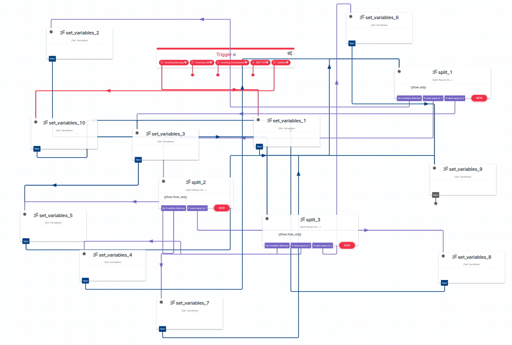
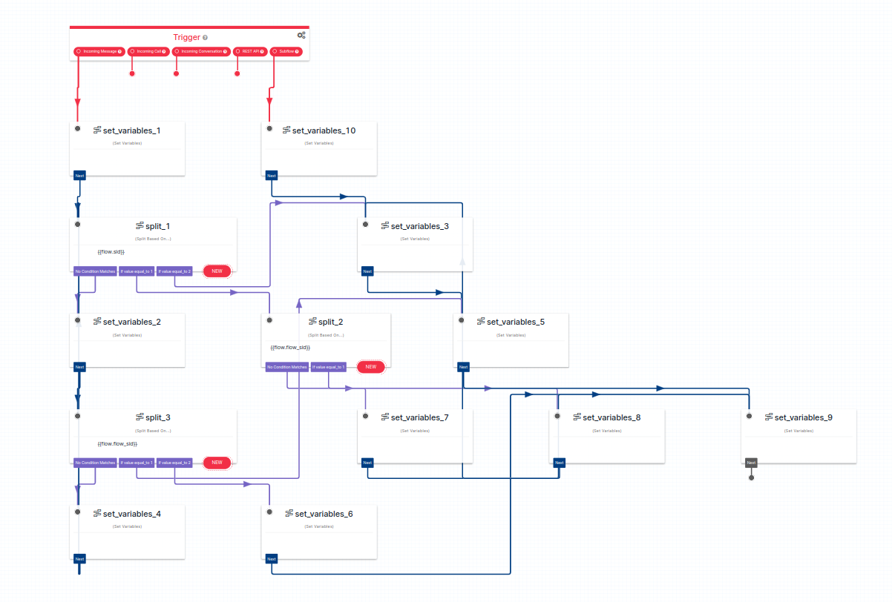

# twilio-flow-format

> Are you tired of your flows looking like this?



> What if you could make it look like this with the press of a button?



> What does it do?

- Formats Twilio flow json files to have consistent `x` & `y` values for every widget based on hierarchy.
- It works by creating a tree structure with `unifiedjs` to link every node then puts each node on a level (y) and
  column (x) with some whitespace.

## Install

- Install: https://bun.sh/

```bash
bun install
```

## Run

```bash
bun run format <absolute file path to flow json file>
```

- Outputs to a file `./output.json`
- Output will put json all on 1 line, just put it into any editor and use the built-in whitespace formater and your diff should only show `x` & `y` changes.
